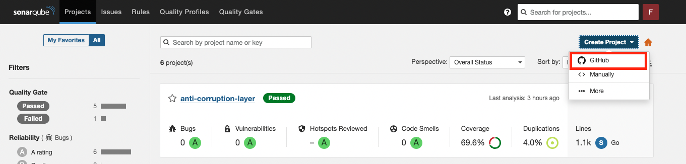
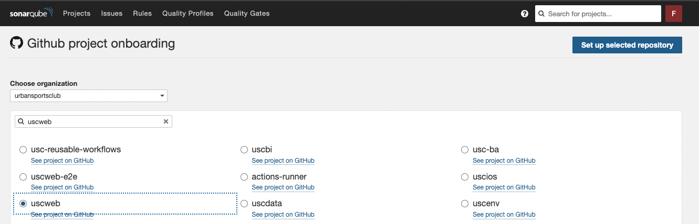
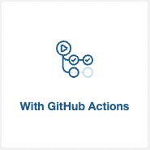
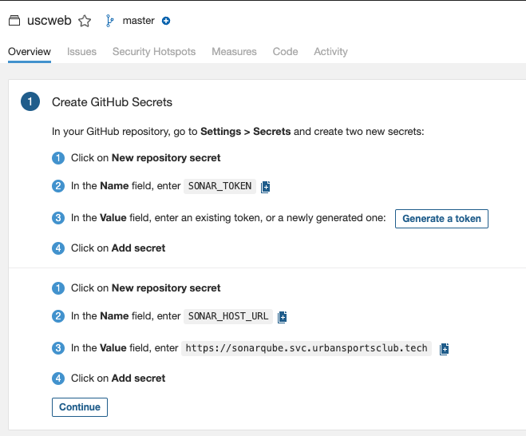
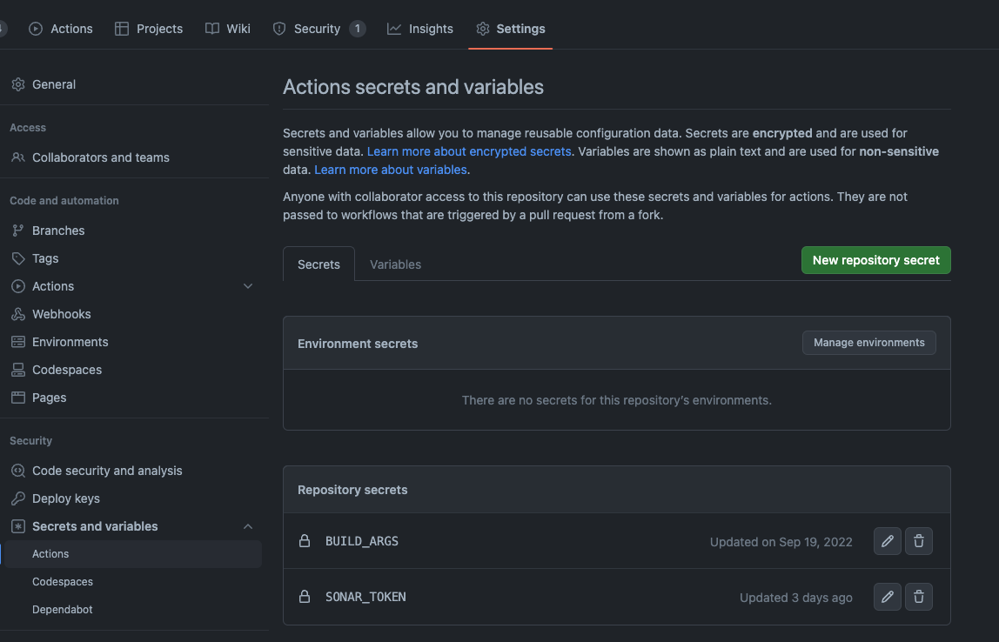
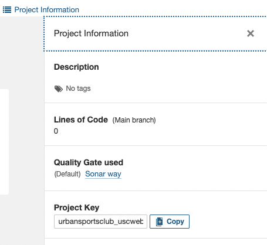

# Reusable Workflows

This is our set of reusable workflows that you can use to make your life simpler when dealing with a few standard actions in our CI.

## Call Build & Push Docker Workflow

If you want to build and push images you can simply add this to your workflow

```
name: Build and push docker

on:
  pull_request:
    branches:
      - main

jobs:
  call-docker-build-push-workflow:
    uses: urbansportsclub/usc-reusable-workflows/.github/workflows/build-and-push-docker-image.yaml@main
    with:
      repository: usc-your-repo
      image_name: your-awesome-app
      project_id: urbansportsclub-dev
      dockerfile_path: "Dockerfile"
```

We use docker/metadata to guess your image tag based on your branch, or tag. This will then be pushed to GCR and you can use that when deploying.

## Call Deploy to Kubernetes Workflow ( Helm ) 

Putting all together, we have the following.

```
name: Deploy to Kubernetes Cluster 

on:
  pull_request:
    branches:
      - main

jobs:

  call-docker-build-push-workflow:  # ID of the build job
    uses: urbansportsclub/usc-reusable-workflows/.github/workflows/build-and-push-docker-image.yaml@main
    with:
      repository: usc-your-repo
      image: your-awesome-app
      project_id: urbansportsclub-dev
      dockerfile_path: "Dockerfile"
      # image_tag: "v1.14.14"  # Add this line if you need to specify docker image tag

  deploy-to-k8s-workflow:
    uses: urbansportsclub/usc-reusable-workflows/.github/workflows/deploy-to-k8s-cluster.yaml@main
    needs: call-docker-build-push-workflow
    with:
      chart_path: "charts/your-chart-directory"  # No trailing slash at the end of the chart path.
      chart_name: "your-chart-name"
      image_version: ${{ needs.call-docker-build-push-workflow.outputs.image_version }}  # Same as the ID of the build job 
      namespace: "test"
      stage: "dev"
      gke_cluster: "internal"
      sops: true
```

## Rollback Workflow

```
name: Rollback Helm Deployment 

on:
  workflow_dispatch:
    inputs:
      version:
        description: 'Revision ( version ) number. Enter 0 to rollback previous release.'     
        required: true
        default: '0'
  pull_request:
    branches:
      - main

jobs:

  helm-rollback-workflow:
    uses: urbansportsclub/usc-reusable-workflows/.github/workflows/helm-rollback.yaml@main
    with:
      chart_name: "your-chart-name"
      version: 0 # Optional, Revision (version) number. If this argument is omitted, it will rollback to the previous release.
      namespace: "test"
      gke_cluster: "internal"
      project_id: "urbansportsclub-dev" # GCP Project ID
      runner: "deploy" # Which Action Runner to use, change to "deploylive" for staging/live deployments.
```

## SonarQube
### Setting Up

1. Sign in to [sonarqube.svc.urbansportsclub.tech](https://sonarqube.svc.urbansportsclub.tech/).
2. Click on the `Create Project` button in the top right corner and select `Github`.


3. Select the organization and repository you want to create the project for, then click `Set up selected repository`.



4. Select `GitHub Actions` to set up the repository and generate a `SONAR_TOKEN` to send data from your repository.



5. Copy the token and go to your repository in GitHub, then set a new secret with the name `SONAR_TOKEN` and paste the token.





6. Return to the SonarQube page and click `Continue` to finish the tutorial.

7. Retrieve the `Project key` by clicking the `Project information` link in the top right corner of the project page and copying the value.



### Properties file

You need to include a file called `sonar-project.properties` in the root of your project in order for SonarScan to work properly. This file holds certain properties that SonarQube needs to function. For more information, please refer to the full documentation [here](https://docs.sonarqube.org/latest/analyzing-source-code/scanners/sonarscanner/).

Here is an example for Golang projects:

```toml
sonar.projectKey=[STEP 7]

sonar.tests=.
sonar.test.inclusions=**/*_test.go
sonar.test.exclusions=**/vendor/**

sonar.sources=.
sonar.exclusions=**/*_test.go,**/vendor/**,**/testdata/*

sonar.go.coverage.reportPaths=coverage.out
```

### Using the Workflow

Here is an example on how to use SonarQube in your pull requests:

```yaml
---
name: Lint and Test
on:
  pull_request:
    branches:
      - "*"

jobs:
  test:
    name: Test
    uses: urbansportsclub/usc-reusable-workflows/.github/workflows/test-go.yaml@main
    secrets:
      github-token: ${{ secrets.GB_TOKEN_PRIVATE }}

  scan:
    name: Sonarqube Scan
    needs: [ test ]
    uses: urbansportsclub/usc-reusable-workflows/.github/workflows/sonarqube-scan.yaml@main
    with:
      download_coverage_artifact: true
    secrets:
      token: ${{ secrets.SONAR_TOKEN }}
```

Here is an example on how to use SonarQube for the `master|main` branch. You can notice that we are exposing two inputs for the `scan`:

- `enable_quality_gate`: should be set to `false` if you don't want your workflow to fail.
- `download_coverage_artifact`: it will download the coverage file from the test.

```yaml
---
name: Build and Deploy Staging
on:
  push:
    branches:
      - master

jobs:
  test:
    name: Test
    uses: urbansportsclub/usc-reusable-workflows/.github/workflows/test-go.yaml@main
    secrets:
      github-token: ${{ secrets.GB_TOKEN_PRIVATE }}
  
  scan:
    name: Sonarqube Scan
    needs: [ test ]
    uses: urbansportsclub/usc-reusable-workflows/.github/workflows/sonarqube-scan.yaml@main
    with:
      enable_quality_gate: false
      download_coverage_artifact: true
    secrets:
      token: ${{ secrets.SONAR_TOKEN }}
```

### Code coverage for other languages

Your test step should output a coverage file for use with other languages, which should then be uploaded to GitHub artifacts. Since the upload and download of the file occur at different times, you need to specify the name of the artifact to be downloaded.

```yaml
test:
  - name: Run tests with phpunit/phpunit
    run: vendor/bin/phpunit --coverage-clover=coverage.xml

  - name: Archive code coverage results
    uses: actions/upload-artifact@v3
    with:
      name: php-coverage-xml
      path: coverage.xml
      retention-days: 5
      if-no-files-found: error

scan:
  name: Sonarqube Scan
  needs: [ test ]
  uses: urbansportsclub/usc-reusable-workflows/.github/workflows/sonarqube-scan.yaml@main
  with:
    enable_quality_gate: true
    download_coverage_artifact: true
    coverage_artifact_name: php-coverage-xml
  secrets:
    token: ${{ secrets.SONAR_TOKEN }}
```


### Custom dependencies

If you need to add more dependencies for a workflow there is already an implemented solution in test-go (.github/workflows/lint-and-test.yml) that allows to install custom dependencies on the current runner just before the main action of the reusable-workflow.

You just need to add the input `external_container_dependencies` with your desired commands to run on the runner:

```yaml
  test:
    name: Test
    uses: urbansportsclub/usc-reusable-workflows/.github/workflows/test-go.yaml@install-dependencies-go-invoices
    with:
      external_container_dependencies: |
        sudo apt update
        sudo apt-get -y install poppler-utils wv unrtf tidy
        go get github.com/JalfResi/justext
        go install code.sajari.com/docconv/docd@latest
```
